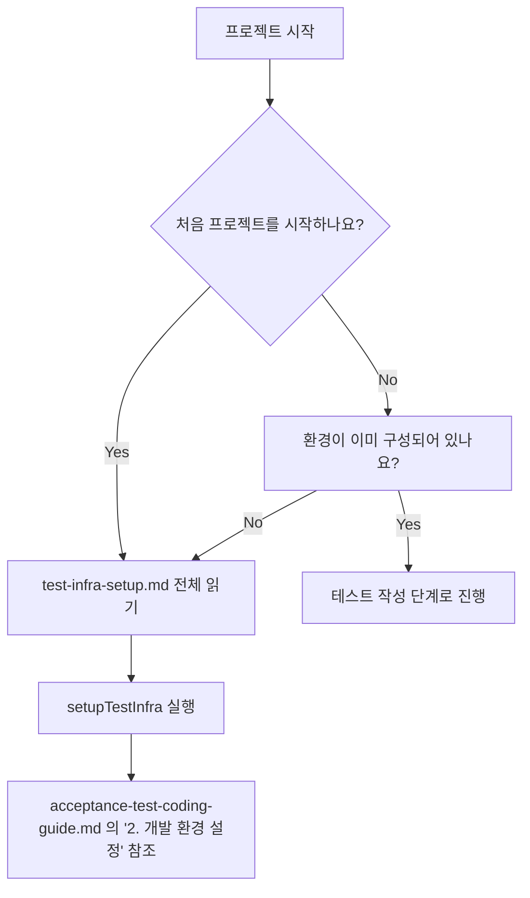
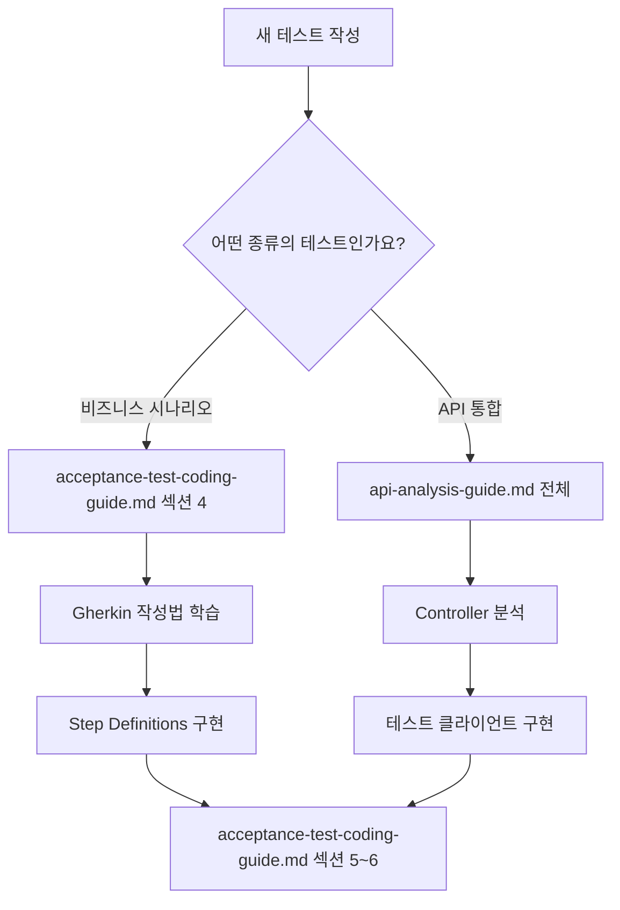
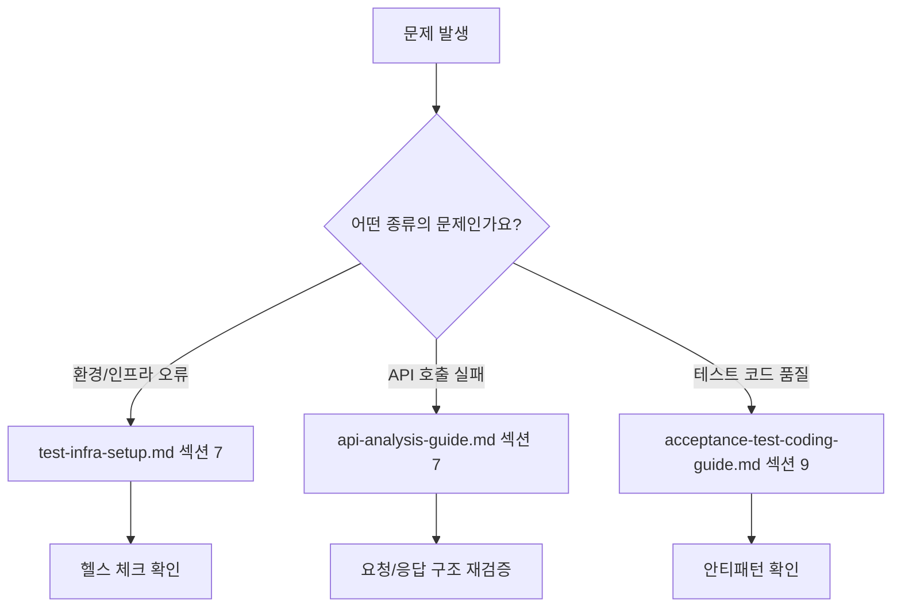

# 인수 테스트 작성 시 문서 참조 가이드

## 📖 개요

이 문서는 ATDD 캠핑 예약 시스템의 인수 테스트를 작성할 때 어떤 문서를 언제 참조해야 하는지에 대한 종합적인 가이드입니다. 개발자가 빠르고 정확하게 필요한 정보를 찾을 수 있도록 상황별 문서 참조 방법을 제시합니다.

## 📚 문서 구조 및 역할 소개

### 1. `test-infra-setup.md` - 인프라 구성 및 환경 설정
**주요 역할**: 테스트 환경 구축과 인프라 관리
**핵심 내용**:
- 프로젝트 의존성 및 빌드 설정
- `setupTestInfra` 태스크 워크플로우
- Docker 컨테이너 오케스트레이션
- MySQL/WireMock 헬스 체크
- 필수 실행 명령어

### 2. `acceptance-test-coding-guide.md` - 테스트 코드 작성 가이드
**주요 역할**: 실제 테스트 코드 구현 방법론
**핵심 내용**:
- 한국어 Gherkin 시나리오 작성법
- Step Definitions 구현 패턴
- API 테스트 클라이언트 구현
- TestContext 상태 관리
- 베스트 프랙티스 및 안티패턴

### 3. `api-analysis-guide.md` - API 분석 및 통합 가이드
**주요 역할**: 서비스 API 분석과 클라이언트 구현
**핵심 내용**:
- SpringBoot Controller 분석 방법
- Request/Response DTO 패턴
- 서비스별 테스트 클라이언트 구현
- 복합 시나리오 테스트 기법
- 트러블슈팅 및 체크리스트

## 🔍 상황별 문서 참조 결정 트리

### 🚀 프로젝트 초기 설정 단계



**🎯 참조 우선순위**:
1. **test-infra-setup.md** (전체) - 환경 이해 필수
2. **acceptance-test-coding-guide.md** 섹션 2 - 개발 환경 확인

### 📝 새로운 테스트 시나리오 작성



**🎯 참조 우선순위**:
1. **acceptance-test-coding-guide.md** 섹션 4 - Gherkin 작성법
2. **api-analysis-guide.md** 섹션 2-4 - API 분석 방법
3. **acceptance-test-coding-guide.md** 섹션 5-6 - 구현 패턴

### 🔧 문제 해결 및 디버깅



**🎯 참조 우선순위**:
1. **문제 유형별 해당 가이드의 트러블슈팅 섹션**
2. **관련 체크리스트 활용**

## 📋 시나리오별 문서 활용 가이드

### 시나리오 1: "처음으로 프로젝트를 설정하고 첫 테스트를 작성하고 싶어요"

**📖 읽는 순서**:
1. **test-infra-setup.md** 전체 (30분)
   - 프로젝트 구조와 의존성 이해
   - `./gradlew setupTestInfra` 실행
   - Docker 환경 확인

2. **acceptance-test-coding-guide.md** 섹션 1-3 (20분)
   - 테스트 아키텍처 이해
   - 기본 설정 확인

3. **acceptance-test-coding-guide.md** 섹션 4 (15분)
   - 한국어 Gherkin 기본 문법 학습

**🎯 체크포인트**: `./gradlew test` 명령어가 성공적으로 실행되는가?

### 시나리오 2: "새로운 서비스 API를 분석하고 테스트하고 싶어요"

**📖 읽는 순서**:
1. **api-analysis-guide.md** 섹션 1-2 (25분)
   - 서비스 구조 파악 방법
   - Controller 분석 기법

2. **api-analysis-guide.md** 섹션 3-4 (30분)
   - DTO 구조 파악
   - 테스트 클라이언트 구현

3. **acceptance-test-coding-guide.md** 섹션 6 (15분)
   - API 테스트 클라이언트 패턴 참조

**🎯 체크포인트**: 새 API에 대한 테스트 클라이언트가 정상 작동하는가?

### 시나리오 3: "복잡한 비즈니스 워크플로우를 테스트하고 싶어요"

**📖 읽는 순서**:
1. **acceptance-test-coding-guide.md** 섹션 4-5 (25분)
   - Gherkin 고급 패턴
   - Step Definitions 설계

2. **acceptance-test-coding-guide.md** 섹션 7 (20분)
   - TestContext 활용법
   - 상태 관리 패턴

3. **api-analysis-guide.md** 섹션 6.3 (15분)
   - 복합 시나리오 테스트 기법

**🎯 체크포인트**: 여러 서비스를 조합한 엔드-투-엔드 테스트가 성공하는가?

### 시나리오 4: "테스트가 실패하거나 예상대로 동작하지 않아요"

**📖 문제 해결 순서**:
1. **오류 로그 확인** 후 해당 문서의 트러블슈팅 섹션 참조
   - 환경 오류 → **test-infra-setup.md** 섹션 7
   - API 오류 → **api-analysis-guide.md** 섹션 7
   - 코드 품질 → **acceptance-test-coding-guide.md** 섹션 9

2. **체크리스트 활용**:
   - **api-analysis-guide.md** 섹션 8 - API 분석 및 테스트 체크리스트

**🎯 체크포인트**: 각 문서의 체크리스트를 모두 통과하는가?

## 🚀 빠른 참조 (Quick Reference)

### 자주 찾는 명령어
- **전체 환경 구성**: `./gradlew setupTestInfra` → **test-infra-setup.md** 섹션 6.1
- **테스트 실행**: `./gradlew test` → **test-infra-setup.md** 섹션 6.2
- **인프라만 실행**: Docker 명령어 → **test-infra-setup.md** 섹션 6.3

### 자주 찾는 코드 패턴
- **Gherkin 기본 템플릿** → **acceptance-test-coding-guide.md** 섹션 4
- **API 클라이언트 기본 구조** → **acceptance-test-coding-guide.md** 섹션 6
- **Request/Response DTO 패턴** → **api-analysis-guide.md** 섹션 3
- **TestContext 사용법** → **acceptance-test-coding-guide.md** 섹션 7

### 자주 확인하는 설정
- **서비스 포트 정보** → **test-infra-setup.md** 섹션 2.1
- **데이터베이스 연결 정보** → **acceptance-test-coding-guide.md** 섹션 8
- **환경변수 설정** → **api-analysis-guide.md** 섹션 6.1

## 🔄 문서 간 연관 관계

### 의존성 관계도
```
test-infra-setup.md (기반)
    ↓
acceptance-test-coding-guide.md (핵심)
    ↓
api-analysis-guide.md (심화)
```

### 정보 흐름
1. **test-infra-setup.md**에서 환경 구성 →
2. **acceptance-test-coding-guide.md**에서 기본 패턴 학습 →
3. **api-analysis-guide.md**에서 고급 기법 적용

### 상호 참조 포인트
- **서비스 포트 설정**: test-infra-setup.md ↔ acceptance-test-coding-guide.md
- **API 클라이언트 패턴**: acceptance-test-coding-guide.md ↔ api-analysis-guide.md
- **Docker 환경 설정**: test-infra-setup.md → acceptance-test-coding-guide.md 섹션 8

## ✅ 문서 활용 체크리스트

### 프로젝트 시작 시
- [ ] test-infra-setup.md로 전체 구조 파악
- [ ] setupTestInfra 실행으로 환경 구성
- [ ] acceptance-test-coding-guide.md로 기본 패턴 학습
- [ ] 첫 번째 간단한 테스트 시나리오 작성

### 새 기능 개발 시
- [ ] api-analysis-guide.md로 새 API 분석
- [ ] acceptance-test-coding-guide.md 패턴 적용
- [ ] 복합 시나리오 설계 시 두 문서 모두 참조

### 문제 해결 시
- [ ] 해당 문서의 트러블슈팅 섹션 확인
- [ ] 관련 체크리스트로 누락 사항 점검
- [ ] 모든 문서의 베스트 프랙티스 재검토

## 🎯 효과적인 문서 활용 팁

### 📝 읽기 전략
1. **순차적 읽기**: 처음에는 test-infra-setup.md → acceptance-test-coding-guide.md → api-analysis-guide.md 순서
2. **필요 기반 읽기**: 특정 작업 수행 시 해당 섹션만 집중적으로 참조
3. **반복 읽기**: 복잡한 패턴은 실제 구현 전후로 여러 번 읽기

### 🔍 검색 활용법
- **키워드 검색**: IDE에서 문서 내 특정 용어나 클래스명 검색
- **섹션 번호 활용**: 동료와 커뮤니케이션 시 "acceptance-test-coding-guide.md 섹션 4.2 참조" 형식 사용
- **예제 코드 찾기**: 구체적인 구현 방법이 필요할 때 코드 블록 위주로 검색

### 💡 개인화 팁
- **북마크 활용**: 자주 참조하는 섹션은 브라우저나 IDE 북마크 등록
- **개인 노트**: 프로젝트별 특이사항이나 자주 까먹는 부분 별도 정리
- **팀 공유**: 새로운 패턴이나 해결법 발견 시 해당 문서 섹션과 함께 팀원들과 공유

---

## 📞 도움이 더 필요할 때

이 가이드로도 해결되지 않는 문제가 있다면:

1. **각 문서의 트러블슈팅 섹션** 재확인
2. **전체 체크리스트** 항목별 점검
3. **내 기존 테스트 코드** 참조

> 💡 **Pro Tip**: 이 가이드는 테스트 작성 여정의 나침반 역할을 합니다. 각 단계에서 적절한 문서를 참조하여 효율적이고 품질 높은 인수 테스트를 작성해보세요!
